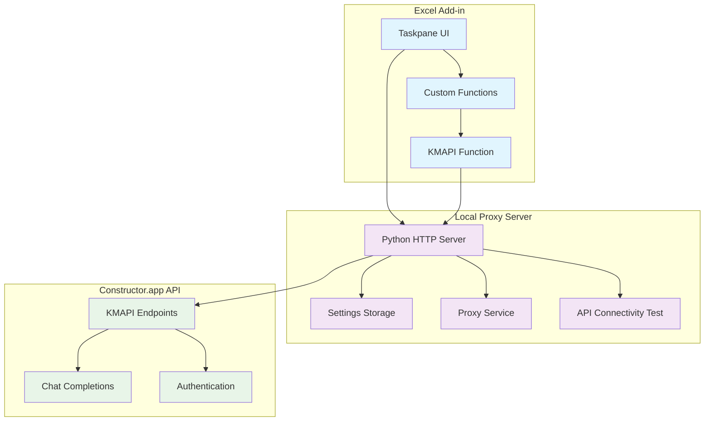
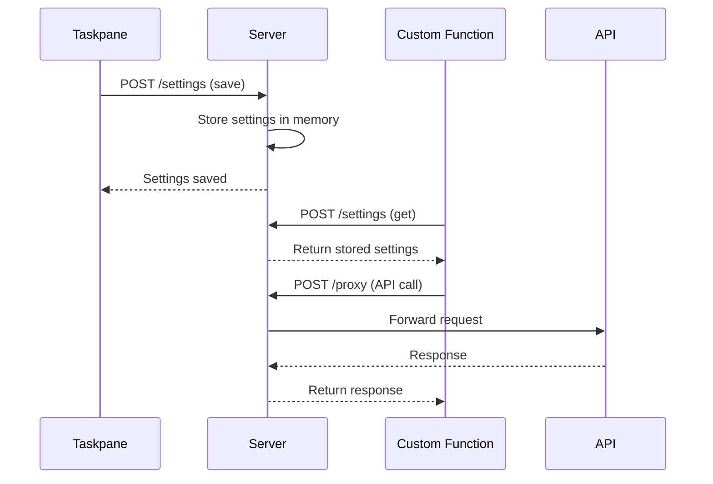
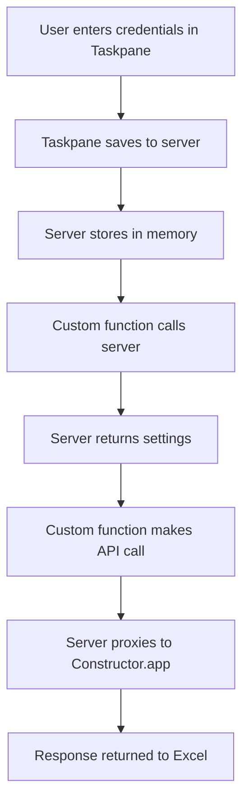

# KMAPI Excel Add-in

A Microsoft Excel add-in that integrates with Constructor.app's KMAPI endpoints, providing custom functions for AI-powered chat completions directly in Excel.

## 🏗️ Architecture Overview



## 🎯 Key Design Principles

### 1. **Localhost Proxy Approach**
Instead of making direct API calls from Excel (which face CORS limitations), all requests go through a local Python proxy server:

```javascript
// Instead of direct API calls
fetch('https://constructor.app/api/...') // ❌ CORS issues

// Use local proxy
fetch('http://localhost:8000/proxy', {
    method: 'POST',
    body: JSON.stringify({
        url: 'https://constructor.app/api/...',
        headers: { /* API headers */ },
        body: '/* request body */'
    })
}) // ✅ No CORS issues
```

### 2. **Server-Side Settings Storage**
To avoid Excel's context limitations between taskpane and custom functions, settings are stored on the server:



### 3. **Minimal Excel-Side Logic**
Excel add-ins have limitations with context switching and global state. The solution minimizes Excel-side complexity:

```javascript
// ❌ Avoid: Complex Excel context operations
window.Excel.run(function(context) {
    // Complex operations that can fail
})

// ✅ Prefer: Simple server calls
fetch('/settings', {
    method: 'POST',
    body: JSON.stringify({ action: 'get' })
})
```

## 📁 Project Structure

```
constr-excel/
├── manifest.xml          # Excel add-in configuration
├── taskpane.html         # Settings UI
├── taskpane.js           # Taskpane logic
├── functions.html         # Custom functions loader
├── functions.js           # Custom functions implementation
├── functions.json         # Function metadata
├── server.py             # Local proxy server
├── assets/               # Icons and resources
└── README.md            # This documentation
```

## 🔧 Implementation Details

### Server Endpoints

#### `/settings` - Settings Management
```python
# Save settings
POST /settings
{
    "action": "save",
    "settings": {
        "knowledge_model_id": "your_model_id",
        "api_key": "your_api_key",
        "default_extension": "direct_llm",
        "default_model_alias": "gpt-4o-2024-08-06",
        "max_tokens": 2048,
        "temperature": 0.7
    }
}

# Get settings
POST /settings
{
    "action": "get"
}
```

#### `/proxy` - API Proxy
```python
# Proxy API requests
POST /proxy
{
    "url": "https://constructor.app/api/platform-kmapi/v1/knowledge-models/{model_id}/chat/completions/{extension}",
    "method": "POST",
    "headers": {
        "X-KM-AccessKey": "Bearer your_api_key",
        "Content-Type": "application/json"
    },
    "body": "/* JSON request body */"
}
```

#### `/test-api` - Connectivity Test
```python
# Test API connectivity
GET /test-api
# Returns: {"status": "success", "message": "API connectivity test successful"}
```

### Custom Functions

#### `KMAPI(userMsg, systemMsg, model, extension)`
Main function for chat completions:

```javascript
function KMAPI(userMsg, systemMsg, model, extension) {
    return new Promise(function (resolve, reject) {
        // 1. Get settings from server
        getKMAPISettings().then(function(settings) {
            // 2. Make API request through proxy
            makePostRequest(url, {
                headers: headers,
                body: JSON.stringify(body)
            })
            .then(function(json) {
                // 3. Parse and return response
                resolve(json.choices[0].message.content);
            })
        });
    });
}
```

### Settings Flow



## 🚀 Setup Instructions

### 1. Start the Local Server
```bash
python server.py
# Server runs on http://localhost:8000
```

### 2. Install Excel Add-in
1. Copy `manifest.xml` to Excel's WEF folder
2. Add `http://localhost:8000` to Excel's Trusted Add-in Catalogs
3. Load the add-in in Excel

### 3. Configure Settings
1. Open the add-in taskpane
2. Enter your Constructor.app API credentials
3. Click "Save Settings"

### 4. Use Custom Functions
```excel
=KMAPI("Hello, how are you?")
=KMAPI("Explain quantum computing", "You are a helpful assistant")
```

## 🔄 Extending Functionality

### Adding New API Endpoints

1. **Add server endpoint** in `server.py`:
```python
def handle_new_endpoint(self):
    # Your endpoint logic
    pass
```

2. **Add custom function** in `functions.js`:
```javascript
function NEWFUNCTION(param1, param2) {
    return new Promise(function (resolve, reject) {
        // Your function logic
    });
}
```

3. **Register function** in `functions.json`:
```json
{
  "id": "NEWFUNCTION",
  "name": "NEWFUNCTION",
  "description": "Your function description"
}
```

### Adding New Settings

1. **Update server settings** in `server.py`:
```python
SETTINGS = {
    # ... existing settings
    "new_setting": "default_value"
}
```

2. **Update taskpane UI** in `taskpane.html`:
```html
<input type="text" id="new_setting" placeholder="New Setting">
```

3. **Update taskpane logic** in `taskpane.js`:
```javascript
var new_setting = document.getElementById("new_setting").value;
// Include in settings object
```

### Adding New Custom Functions

1. **Implement function** in `functions.js`:
```javascript
function NEWFUNCTION(param1, param2) {
    return new Promise(function (resolve, reject) {
        getKMAPISettings().then(function(settings) {
            // Your implementation
            makePostRequest(url, options)
            .then(function(response) {
                resolve(response);
            })
            .catch(function(error) {
                reject(error);
            });
        });
    });
}
```

2. **Add metadata** in `functions.json`:
```json
{
  "id": "NEWFUNCTION",
  "name": "NEWFUNCTION",
  "description": "Description of what the function does",
  "result": {
    "type": "string",
    "dimensionality": "scalar"
  },
  "parameters": [
    {
      "name": "param1",
      "description": "First parameter",
      "type": "string",
      "dimensionality": "scalar"
    }
  ]
}
```

3. **Register function** in `functions.js`:
```javascript
// @ts-ignore
CustomFunctions.associate("NEWFUNCTION", NEWFUNCTION);
```

## 🛠️ Development Best Practices

### 1. **Always Use the Proxy Pattern**
```javascript
// ✅ Correct: Use proxy for all external API calls
makePostRequest('https://constructor.app/api/...', options)

// ❌ Avoid: Direct API calls from Excel
fetch('https://constructor.app/api/...')
```

### 2. **Store Settings on Server**
```javascript
// ✅ Correct: Server-side settings
fetch('http://localhost:8000/settings', {
    method: 'POST',
    body: JSON.stringify({ action: 'get' })
})

// ❌ Avoid: Excel workbook settings in custom functions
window.Excel.run(function(context) {
    // Can cause context issues
})
```

### 3. **Handle Errors Gracefully**
```javascript
function KMAPI(userMsg, systemMsg, model, extension) {
    return new Promise(function (resolve, reject) {
        try {
            // Your implementation
        } catch (error) {
            reject(new Error("Clear error message"));
        }
    });
}
```

### 4. **Use Proper Authentication Headers**
```javascript
var headers = {
    "X-KM-AccessKey": "Bearer " + api_key,  // ✅ Correct format
    "Content-Type": "application/json",
    "Accept": "application/json"
};
```

## 🔍 Troubleshooting

### Common Issues

1. **Server not running**: Ensure `python server.py` is running
2. **CORS errors**: All requests must go through the local proxy
3. **Settings not found**: Save settings in taskpane first
4. **API errors**: Check authentication headers and API key validity

### Debug Functions

- `=TESTGLOBALS()` - Test server settings connectivity
- `=TESTAPICONNECTIVITY()` - Test API connectivity
- `=VALIDATEAPIKEY(api_key)` - Validate API key

## 📚 API Reference

### Constructor.app KMAPI Endpoints

- **Chat Completions**: `POST /api/platform-kmapi/v1/knowledge-models/{model_id}/chat/completions/{extension}`
- **Health Check**: `GET /api/platform-kmapi/alive`

### Authentication
- **Header**: `X-KM-AccessKey: Bearer your_api_key`
- **Content-Type**: `application/json`

### Request Format
```json
{
  "model": "gpt-4o-2024-08-06",
  "messages": [
    {
      "role": "user",
      "content": [{"type": "text", "text": "Your message"}]
    }
  ],
  "response_format": {"type": "text", "json_schema": {}},
  "temperature": 0.7,
  "max_completion_tokens": 2048
}
```

This architecture provides a robust, extensible foundation for integrating Constructor.app's KMAPI with Excel, avoiding common Excel add-in limitations while maintaining clean separation of concerns. 